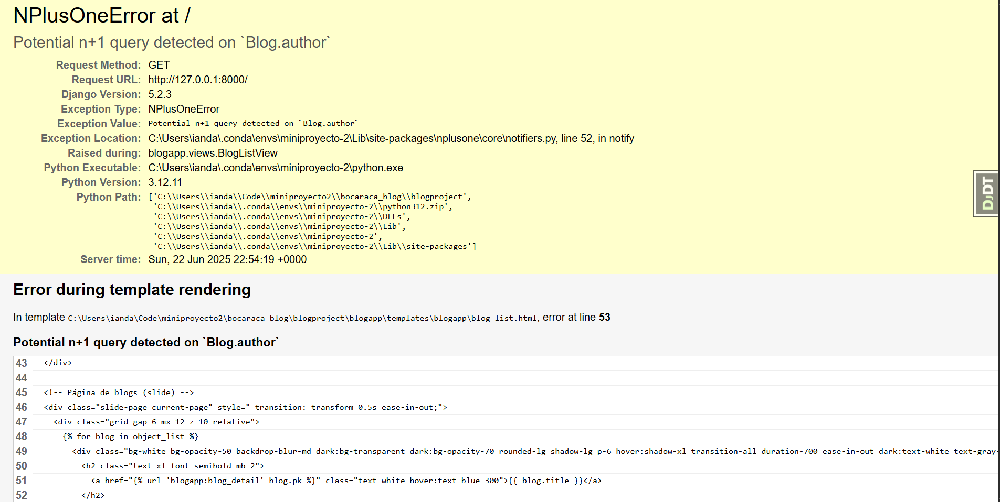
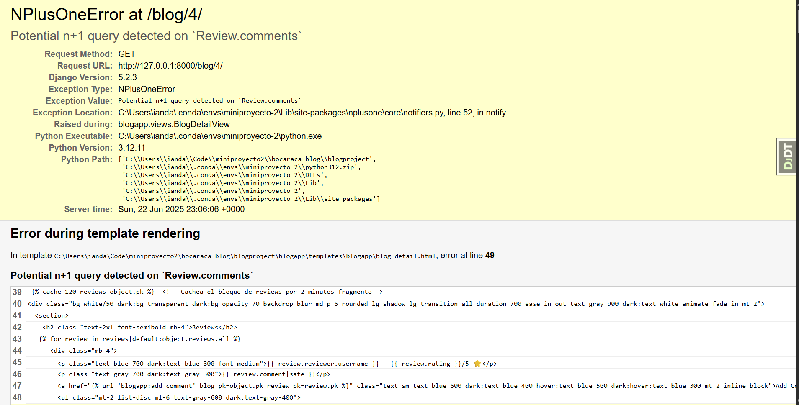
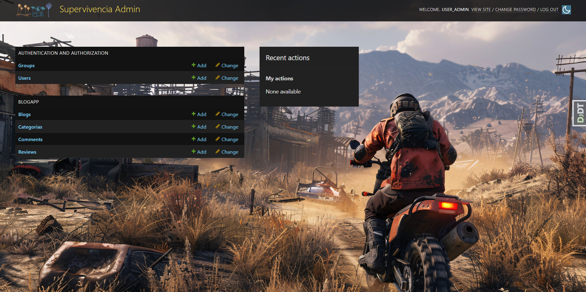
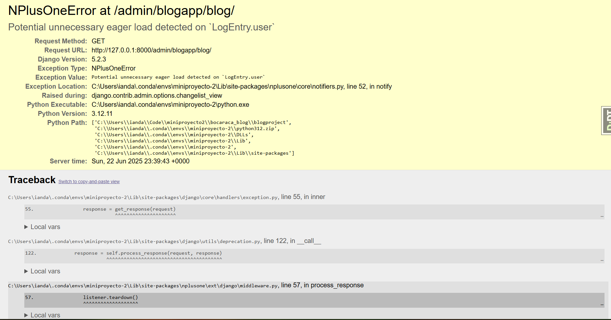

# **Optimizacion del ORM** #
Para poder realizar esta optimizacion primero es importante ver las secciones de codigo en las que puede estarse usando las llamadas a la base de datos de manera poco optimizada agregando el siguiente codigo al `settings.py`
``` Python
LOGGING = {
    'version': 1,
    'disable_existing_loggers': False,
    'handlers': {
        'console': {
            'level': 'WARNING',
            'class': 'logging.StreamHandler',
        },
    },
    'loggers': {
        'nplusone': {
            'handlers': ['console'],
            'level': 'INFO',
            'propagate': False,
        },
    },
}
```

Poteriormente es importante la instalacion de la libreria debug-toolbar para ver ejecuciones de querys y ese tipo de cosas en el 
codigo
`pip install django-debug-toolbar`

Se realizaron ciertas modificaciones en `url.py` y `settings.py` para hacer uso de esta libreria dentro del codigo al final esto genera una barra lateral con temas de ciertas cosas que se consumen en la ejecucion

### **Uso de  `nplusone`** ###

Primero se debe instalar la libreria
`pip install nplusone`

Esta libreria permitira detectar errores del tipo N+1 dentro del codigo.
Lo ideal para realizar pruebas iniciales de funcionamiento es crear una vista falsa con errores a proposito y que asi se puedan corregir

A continuacion se modifica el `views.py` anadiendo el codigo siguiente para agregar cambios pertinentes e informacion sobre la nueva vista

``` Python
def vista_prueba_nplusone(request):
    # Vista diseñada para generar un problema N+1
    blogs = Blog.objects.all()
    datos = []
    for blog in blogs:
        # Acceder a la relación M2M 'categorias' en un bucle genera consultas N+1
        categorias_nombres = [categoria.nombre for categoria in blog.categorias.all()]
        datos.append({
            'titulo': blog.title,
            'categorias': categorias_nombres,
        })
    return render(request, 'blogapp/vista_prueba.html', {'datos': datos})
```

Se crea un archivo html para las vistas pruebas el cual se encontrara en `blogapp/templates/blogapp`

```html
<!DOCTYPE html>
<html>
<head>
    <title>Vista de Prueba N+1</title>
</head>
<body>
    <h1>Blogs y Categorías</h1>
    <ul>
    
        <li>{{ item.titulo }} - Categorías: {{ item.categorias|join:", " }}</li>
    
    </ul>
</body>
</html>
```
Se agrega una url al `urls.py` de blogapp mediante

```Python
path('prueba/', views.vista_prueba_nplusone, name='vista_prueba_nplusone'),
```
Tambien se anadio la importacion de una libreria en el mismo archivo por un error que se producia
`from blogapp import views`

Ahora bien en cuanto al archivo settings se anadieron las siguientes lineas por que no esta siendo capas de detectar los errores 
```Python
NPLUSONE_RAISE = False  # para que no levante excepción, solo loguee
NPLUSONE_LOGGER = True  # para que loguee en consola o archivo
```

NO funciono asi que se agrego en settings.py
`import logging #TEMPORAL` 
Se cambio el NPLUSONE LOGGER POR
`NPLUSONE_LOGGER = logging.getLogger('nplusone')`

Como los cambios funcionaron se remplazo temporal con #optimizacionORM - nplusone
En este punto aun se pueden hacer pruebas respecto a errores de N+1

Deteccion de errores y su posterior correccion del tipo N+1
Los cambios en el codigo respecto a errores N+1 los marcaremos como `#Error N+1 -`
Estos cambios implican el uso de `prefetch_related`

### **ERROR - 1** ###


La imagen muestra un error en la parte inicial en el Login. Se corrigio modificando el archivo `views.py`especificamente modificando
la linea mencionada con comentarios en esta seccion
```Python
    def get_queryset(self):
        queryset = super().get_queryset().order_by('-created_at') # Se cambia esta linea
        categoria_slug = self.request.GET.get('categoria')
        if categoria_slug:
            queryset = queryset.filter(categorias__slug=categoria_slug)
        return queryset
```
por 

```Python
    def get_queryset(self):
        #Error N+1 - Correccion de la linea se cambio un codigo anterior, no se agrego completamente
        queryset = super().get_queryset().select_related('author').order_by('-created_at')
        #Error N+1 - Correccion de la linea se cambio un codigo anterior, no se agrego completamente
        categoria_slug = self.request.GET.get('categoria')
        if categoria_slug:
            queryset = queryset.filter(categorias__slug=categoria_slug)
        return queryset
```

### **ERROR - 2** ###


Para corregir se importa la libreria 
```Python
from django.db.models import Prefetch
```
 Y se cambia la funcion get_context_data anterior 
 
 ```Python
     def get_context_data(self, **kwargs):
        context = super().get_context_data(**kwargs)
        context['now'] = datetime.now()

        # Caché de consulta para las reviews
        cache_key = f'reviews_for_blog_{self.object.pk}'
        reviews = cache.get(cache_key)
        if not reviews:
            # Consulta a la base de datos si no está en caché
            reviews = Review.objects.filter(blog_id=self.object.pk).select_related('reviewer')
            cache.set(cache_key, reviews, timeout=300)  # 5 minutos (300 segundos)
        context['reviews'] = reviews
        return context
 ```
 Por esta:

``` Python
    def get_context_data(self, **kwargs):
        context = super().get_context_data(**kwargs)
        context['now'] = datetime.now()

        cache_key = f'reviews_for_blog_{self.object.pk}'
        reviews = cache.get(cache_key)
        if not reviews:
            # Pre-fetch comments y también select_related del commenter
            reviews = Review.objects.filter(blog_id=self.object.pk)\
                .select_related('reviewer')\
                .prefetch_related(
                    Prefetch(
                        'comments',
                        queryset=Comment.objects.select_related('commenter')
                    )
                )
            cache.set(cache_key, reviews, timeout=300)
        context['reviews'] = reviews
        return context
```

### **ERROR - 3** ### 

Este error se da en la ventana de admin especificamente al seleccionar la opcion Blog 





Cambios en el archivo `admin.py`

**Se cambio la clase blog admin por**

```Python
@admin.register(Blog)
class BlogAdmin(admin.ModelAdmin):
    form = BlogAdminForm
    list_display = ('title', 'author', 'created_at', 'get_categorias')
    list_filter = ('created_at', 'categorias')
    search_fields = ('title', 'author__username')
    filter_horizontal = ('categorias',)
    save_on_top = True

    fieldsets = (
        (None, {
            'fields': ('title', 'author', 'categorias', 'content'),
        }),
    )

    def get_queryset(self, request):
        queryset = super().get_queryset(request)
        return queryset.select_related('author').prefetch_related('categorias')

    def get_categorias(self, obj):
        return ", ".join([c.nombre for c in obj.categorias.all()])
    get_categorias.short_description = 'Categorías'
```

**Se cambio ReviewAdmin por**
```Python
@admin.register(Review)
class ReviewAdmin(admin.ModelAdmin):
    form = ReviewAdminForm
    list_display = ('reviewer', 'blog', 'rating', 'created_at')
    list_filter = ('rating', 'created_at')
    search_fields = ('reviewer__username', 'blog__title')

    def get_queryset(self, request):
        queryset = super().get_queryset(request)
        return queryset.select_related('reviewer', 'blog')
```
**Se cambio Comment Admin por** 
```Python 
@admin.register(Comment)
class CommentAdmin(admin.ModelAdmin):
    form = CommentAdminForm
    list_display = ('commenter', 'review', 'created_at')
    search_fields = ('commenter__username', 'review__blog__title')

    def get_queryset(self, request):
        queryset = super().get_queryset(request)
        return queryset.select_related('commenter', 'review')
```

